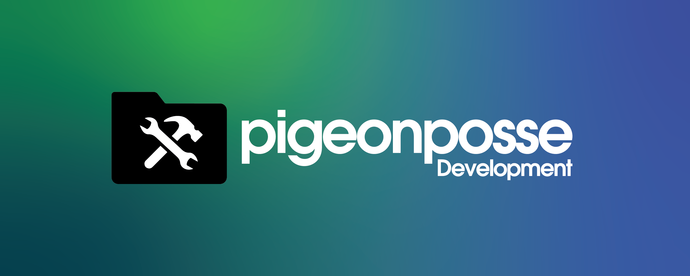

<!--

██████╗ ██╗ ██████╗ ███████╗ ██████╗ ███╗   ██╗ 
██╔══██╗██║██╔════╝ ██╔════╝██╔═══██╗████╗  ██║ 
██████╔╝██║██║  ███╗█████╗  ██║   ██║██╔██╗ ██║ 
██╔═══╝ ██║██║   ██║██╔══╝  ██║   ██║██║╚██╗██║ 
██║     ██║╚██████╔╝███████╗╚██████╔╝██║ ╚████║ 
╚═╝     ╚═╝ ╚═════╝ ╚══════╝ ╚═════╝ ╚═╝  ╚═══╝ 
                                                
██████╗  ██████╗ ███████╗███████╗███████╗       
██╔══██╗██╔═══██╗██╔════╝██╔════╝██╔════╝       
██████╔╝██║   ██║███████╗███████╗█████╗         
██╔═══╝ ██║   ██║╚════██║╚════██║██╔══╝         
██║     ╚██████╔╝███████║███████║███████╗       
╚═╝      ╚═════╝ ╚══════╝╚══════╝╚══════╝       
                                                
                                                
                                                
█████╗█████╗█████╗█████╗█████╗█████╗█████╗█████╗
╚════╝╚════╝╚════╝╚════╝╚════╝╚════╝╚════╝╚════╝
                                                
                                                
                                                
██████╗ ██╗ ██████╗ ███████╗ ██████╗ ███╗   ██╗ 
██╔══██╗██║██╔════╝ ██╔════╝██╔═══██╗████╗  ██║ 
██████╔╝██║██║  ███╗█████╗  ██║   ██║██╔██╗ ██║ 
██╔═══╝ ██║██║   ██║██╔══╝  ██║   ██║██║╚██╗██║ 
██║     ██║╚██████╔╝███████╗╚██████╔╝██║ ╚████║ 
╚═╝     ╚═╝ ╚═════╝ ╚══════╝ ╚═════╝ ╚═╝  ╚═══╝ 
                                                
██████╗ ███████╗██╗   ██╗                       
██╔══██╗██╔════╝██║   ██║                       
██║  ██║█████╗  ██║   ██║                       
██║  ██║██╔══╝  ╚██╗ ██╔╝                       
██████╔╝███████╗ ╚████╔╝                        
╚═════╝ ╚══════╝  ╚═══╝                         
                                                                                       
CREATED BY ANGELO
FOR PIGEONPOSSE.COM

-->

 
 
 

# PIGEON DEV by _PIGEONPOSSE™_

## 🗒 Description

✨ Utilities for faster and more agile development by _PIGEONPOSSE™_

## ⚙️ Usage

- [Ansible](/src/ansible/README.md)
- [Docker](/src/ansible/README.md)
- [Packages](/src/packages)
	+ [eslint](/src/packages/eslint)
	+ [htmlhint](/src/packages/htmlhint)
	+ [stylelint](/src/packages/stylelint)
- [Templates (boilerplates | skeletons)](/src/templates)

## 👨‍💻 Development

You can contribute via **_Github_**.

## ☕ Donate

Help us to develop more interesting things.

 

## 📜 License

This software is licensed with ***[GPLv3](/LICENSE)***.

## 🐦 About us

_PigeonPosse_ is a ✨ **code development collective** ✨ focused on creating practical and interesting tools that help developers and users enjoy a more agile and comfortable experience. Our projects cover various programming sectors and we do not have a thematic limitation in terms of projects.

### Collaborators

|                                                                                    | Name         | Role         | Contribution | GitHub                                         |
| ---------------------------------------------------------------------------------- | ------------ | ------------ | ------------ | ---------------------------------------------- |
|  | Ángel Espejo | Author       | Development | [@AngelEspejo](https://github.com/AngelEspejo) |
|  | PigeonPosse  | Collective   | Distribution | [@PigeonPosse](https://github.com/PigeonPosse) |

 
