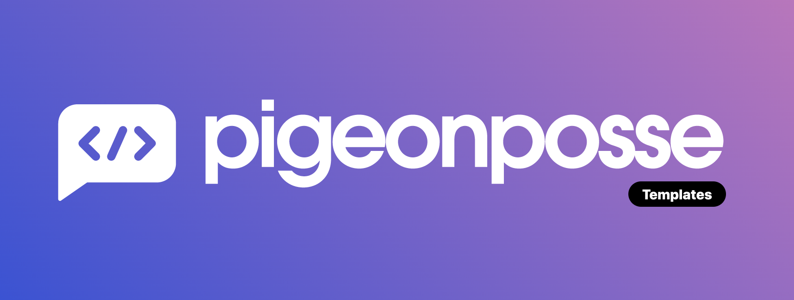

<!---

██████╗ ██╗ ██████╗ ███████╗ ██████╗ ███╗   ██╗                          
██╔══██╗██║██╔════╝ ██╔════╝██╔═══██╗████╗  ██║                          
██████╔╝██║██║  ███╗█████╗  ██║   ██║██╔██╗ ██║                          
██╔═══╝ ██║██║   ██║██╔══╝  ██║   ██║██║╚██╗██║                          
██║     ██║╚██████╔╝███████╗╚██████╔╝██║ ╚████║                          
╚═╝     ╚═╝ ╚═════╝ ╚══════╝ ╚═════╝ ╚═╝  ╚═══╝                          
                                                                         
██████╗  ██████╗ ███████╗███████╗███████╗                                
██╔══██╗██╔═══██╗██╔════╝██╔════╝██╔════╝                                
██████╔╝██║   ██║███████╗███████╗█████╗                                  
██╔═══╝ ██║   ██║╚════██║╚════██║██╔══╝                                  
██║     ╚██████╔╝███████║███████║███████╗                                
╚═╝      ╚═════╝ ╚══════╝╚══════╝╚══════╝                                
                                                                         
                                                                         
                                                                         
█████╗█████╗█████╗█████╗█████╗█████╗█████╗█████╗                         
╚════╝╚════╝╚════╝╚════╝╚════╝╚════╝╚════╝╚════╝                         
                                                                         
                                                                         
                                                                         
██████╗ ██████╗  ██████╗ ██╗    ██╗███████╗███████╗██████╗               
██╔══██╗██╔══██╗██╔═══██╗██║    ██║██╔════╝██╔════╝██╔══██╗              
██████╔╝██████╔╝██║   ██║██║ █╗ ██║███████╗█████╗  ██████╔╝              
██╔══██╗██╔══██╗██║   ██║██║███╗██║╚════██║██╔══╝  ██╔══██╗              
██████╔╝██║  ██║╚██████╔╝╚███╔███╔╝███████║███████╗██║  ██║              
╚═════╝ ╚═╝  ╚═╝ ╚═════╝  ╚══╝╚══╝ ╚══════╝╚══════╝╚═╝  ╚═╝              
                                                                         
███████╗██╗  ██╗████████╗███████╗███╗   ██╗███████╗██╗ ██████╗ ███╗   ██╗
██╔════╝╚██╗██╔╝╚══██╔══╝██╔════╝████╗  ██║██╔════╝██║██╔═══██╗████╗  ██║
█████╗   ╚███╔╝    ██║   █████╗  ██╔██╗ ██║███████╗██║██║   ██║██╔██╗ ██║
██╔══╝   ██╔██╗    ██║   ██╔══╝  ██║╚██╗██║╚════██║██║██║   ██║██║╚██╗██║
███████╗██╔╝ ██╗   ██║   ███████╗██║ ╚████║███████║██║╚██████╔╝██║ ╚████║
╚══════╝╚═╝  ╚═╝   ╚═╝   ╚══════╝╚═╝  ╚═══╝╚══════╝╚═╝ ╚═════╝ ╚═╝  ╚═══╝
                                                                         
████████╗███████╗███╗   ███╗██████╗ ██╗      █████╗ ████████╗███████╗    
╚══██╔══╝██╔════╝████╗ ████║██╔══██╗██║     ██╔══██╗╚══██╔══╝██╔════╝    
   ██║   █████╗  ██╔████╔██║██████╔╝██║     ███████║   ██║   █████╗      
   ██║   ██╔══╝  ██║╚██╔╝██║██╔═══╝ ██║     ██╔══██║   ██║   ██╔══╝      
   ██║   ███████╗██║ ╚═╝ ██║██║     ███████╗██║  ██║   ██║   ███████╗    
   ╚═╝   ╚══════╝╚═╝     ╚═╝╚═╝     ╚══════╝╚═╝  ╚═╝   ╚═╝   ╚══════╝    
                                                                         
CREATED BY ANGELO
DEVELOPED BY PIGEONPOSSE

--->

# {{pp_template_name}} - _Browser extension_

## *Browser extension* for _Chrome/Edge/Opera/Firefox/Brave_

🧩 Download links:

- 
- 
- 

## 👨‍💻 Development

You can contribute via **_Github_**.

## ☕ Donate

Help us to develop more interesting things.

## 📜 License

This software is licensed with [GPLv3](https://github.com/pigeonposse/{{pp_template_name}}/blob/main/LICENSE)

## 🐦 About us

_PigeonPosse_ is a ✨ **code development collective** ✨ focused on creating practical and interesting tools that help developers and users enjoy a more agile and comfortable experience. Our projects cover various programming sectors and we do not have a thematic limitation in terms of projects.

### Collaborators

|                                                                                    | Name        | Role         | GitHub                                         |
| ---------------------------------------------------------------------------------- | ----------- | ------------ | ---------------------------------------------- |
|  | {{pp_author}} |   Author   | [@{{pp_author}}](https://github.com/{{pp_author}}) |
|  | PigeonPosse | Collective	  | [@PigeonPosse](https://github.com/PigeonPosse) |

 
